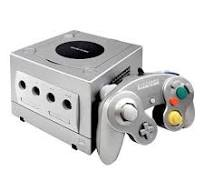
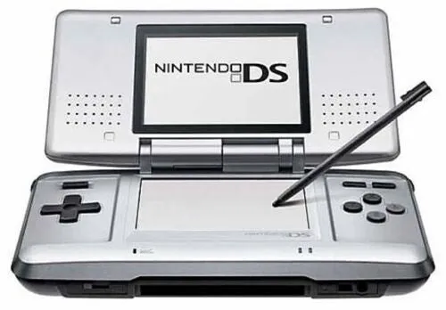
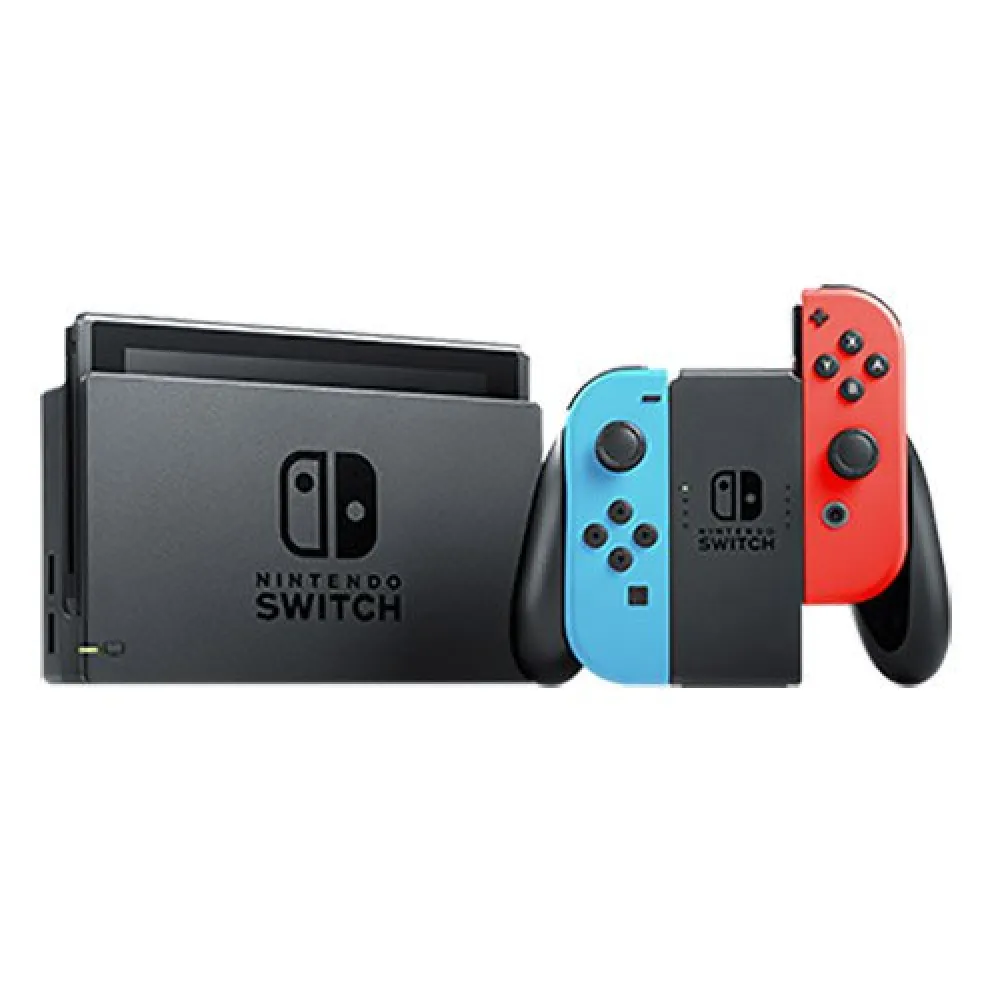
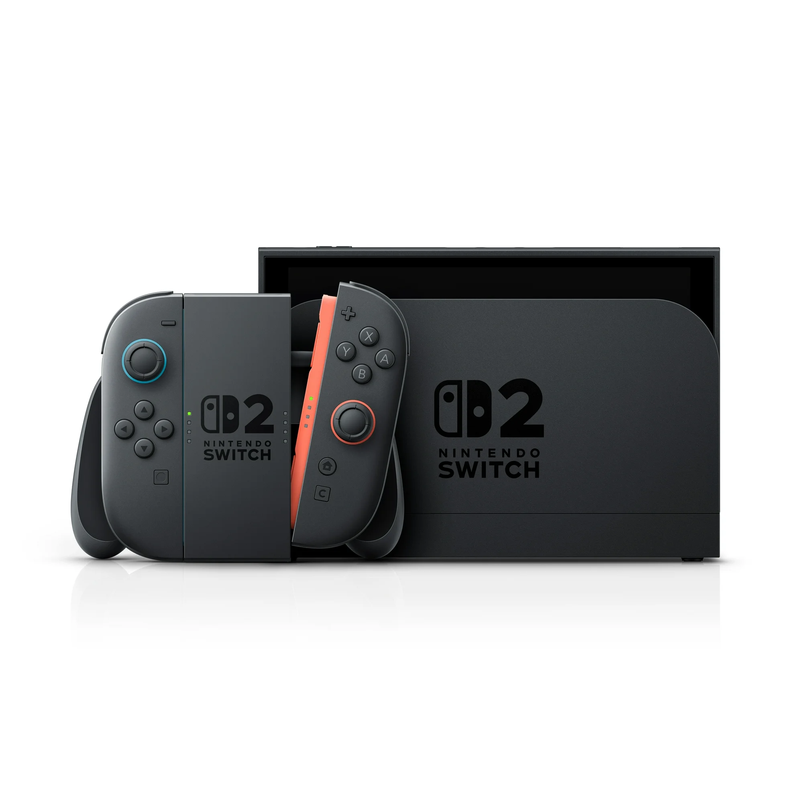

---
title: 스위치 2
date: "2025-07-18T23:58:00.00Z"
description:  스위치 2를 구매했다.
--- 
  이혼 가정의 외동 아들인 나를 위해 엄마는 게임기를 꾸준히 사주셨다. 어렴풋이 원더보이를 했던 기억이 있는데, 기종이 뭔지 기억나진 않는다. 
 저학년 시절에는 플레이스테이션1이 있었는데, 그 당시엔 저장 장치를 따로 장착해 줬어야 데이터가 저장이 됬는데, 그 당시에 그런걸 알 턱이 없어서 매일 매일 같은 코스들을 반복하며 깨던가, 잔머리를 써서 데이터를 잃지 않기 위해, 전원을 끄지 않는 방법을 사용했다. 그래도 끝까지 깰 수 있던 게임은 없었다.

 고학년이 되어선, 시험 점수를 조건으로 게임 큐브를 사줬다. 당시엔 플스 2가 유행이었는데, 나는 게임큐브를 샀다. 플스 2는 한글화도 있었고, 너무 디자인도 잘 빠졌었지만, 비록 예뮬레이터로 게임을 했지만 직접 공략집 까지 작성했던 마리오 64, 친구랑 같이 머리를 맞대서 깼던 젤다의 전설 시간의 오라키나의 신작을 할 수 있다는 게 큰 메리트였기 때문이다. 시험을 잘 보거나 생일과 같은 기념일에 게임 cd를 하나 씩 살수 있었고, 언어를 이해할 수 없는 게임들을 말 그대로 샅샅히 훝으며 진행하며 깰 수 있었다. 가끔 주말에 운 좋게 엄마 보다 일찍 일어나서 게임을 즐기던 여유로운 심상을 가끔씩 그리워한다. 게임 큐브는 4인용 가지 지원이 됐는데, 당시 우리집은 친구들의 아지트가 될 수 있었다.
  
  
  nds도 있었는데, 그 때도 시험을 잘 봐서 샀었던 것 같다.  한국 닌텐도가 들어오기 전에 대원 미디어에서 수입하던 상품을 구매했었는데, 되는대로 용돈을 모아서 게임을 구매 했었던 나는 나중에 한국 닌텐도가 들어오고 포켓몬스터 dp를 한글판을 눈물을 머금고 다시 샀던 기억이난다. 아무튼 그때의 전자 기기는 작고 컴팩트한 느낌이 들었는데, 요즘엔 다 너무나 커진것 같아 아쉽다.

고등학교를 들어가고 콘솔과는 잠시 멀어졌었다. 시험을 못본건 아니고, 사춘기도 오면서 관심이 멀어졌던것 같은데, 콘솔을 하기에 바빴던 것 같기도 하고, 옷 사는게 더 재밌었던 것 같다. 아무튼 나는 12년도에 대학에 들어갔고, 14년도 쯤 자취를 1년정도 한적이있는데, 그때를 계기로 황혼기의 wii를 싼값에 구매하여, 마리오 갤럭시, 마리오 브라더스, 게임 큐브로 일본판으로 뭔 내용인지도 모르고 했던 한글판 젤다의 전설 황혼의 공주 그리고 젤다의 전설 스카이워드 소드 등 손님 맞이용 게임 없이 딱 초 우주명작 만 구매하고 플레이했다. 그 이후로도 뜸하다가 19년도 코로나 쯤 3ds를 7만원에 횡재 구매를 했고, 여자친구는 동물의 숲 열풍이 불자 중고 스위치1을 프리미엄을 주고 바보 구매를 했다. 물론 젤다, 마리오, 포켓몬 등 당연히 해야할 것들을 했고, 가끔씩 술해 취하면, 온라인 샵에서 게임을 구매했다. 여자 친구랑 같이 2인게임을 즐기고 싶었는데 쉽진 않았다.

 2025년 93년 생인 나는 만 31세 아져씨가 되었다. 듣기 싫었던 게임 그만하라던 잔소리도, 빗소리를 들으며 여유롭게 플레이하던 그 풍광이 그리워 질 때가 있다. 스위치2를 샀다는 자랑글을 쓰려고 했는데, 나에게 있어 이 제품의 가장 큰 장점은 그 시절 즐거웠던 추억인 것 같다.