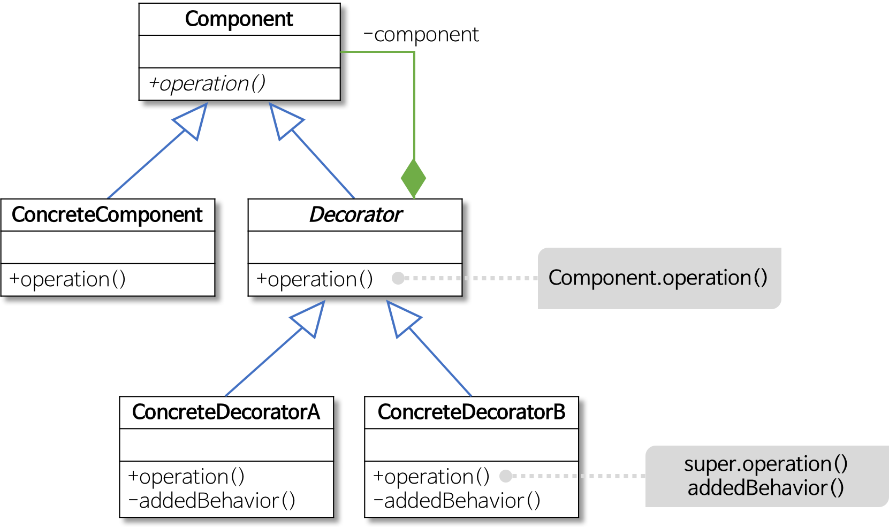

- 상속을 사용하는 서브클래스를 만들지 않고, 객체의 결합을 통해 추가요소를 동적으로 더할수 있다.
- 데코레이터는 componet를 확장한다.
- 데코레이터 패턴에선, 클래스 형식은 그 클래스가 감싸는 클래스 형식은 반영한다.component에 대한 인스턴스 참조를 유지한다.
- 자기가 감싸고 있는 구성 요소의 메소드를 호출한 결과에 새로운 기능을 더함으로써 확장한다.
- OCP 개방 폐쇄 원칙: 확장에 열려있고, 변화에 닫아야한다. 데코레이터 패턴은 동작을 동적으로 확장시켜준다. 슈퍼클래스에 영향을 주지않는다.
