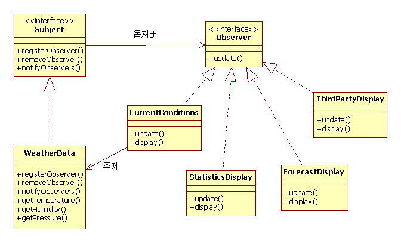

- 정의 : 한 객체의 상태가 변하면 그객체를 의존하는 다른객체에게 연락이 가고 자동으로 내용이 갱신되는 일대 다의존성을 정의한다.
- 옵저버 : 주제를 구독하는 주체, update 인터페이스 구현
- 주제: 옵저버를 관리, 주제의 상태 notify
- 일반적으로 notify로 다알려주면 push, 필요한 것만 가져오면 pull, 대체로 풀이 유지보수가 쉽다.
- 장: 객체간 느슨한 결합 , 옵저버의 종류, 옵저버의 수, 주제 등 의 변화에 영향이 적다.
  - 상호 작용하는 객체 사이에는 가능하면 느슨한 결합을 사용한다
