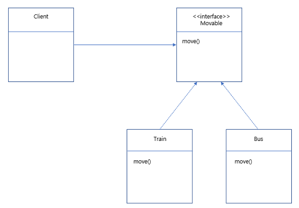

행동을 알고리즘 군으로 묶어 합성을 사용해 행동을 쉽게 확장할 수 있는 방법

알고리즘 군을 정의하고 캡슐화해서 각각의 알고리즘군을 수정해서 쓸 수 있게 한다.
전략 패턴을 사용하면 클라이언트로부터 알고리즘을 분리해서 독립적으로 사용할수 있다.

상속의 단점 : 상속 받는 클래스가 많아질 수록 유지수성이 떨어짐

- 소프트웨어 원칙 3가지
  1. 애플리케이션에서 달라지는 부분을 찾아내고 달리지지 않는 부분과 분리한다.
     - 달라지는 부분은 캡슐화하여 행동을 위임한다.
     - 변화하는 행동 부분은 클래스 집합을 만든다.
  2. 구현보다는 인터페이스에 맞춰서 프로그래밍한다.
     - 실제 실행시 쓰이는 객체가 코드에 고정되지 않도록 상위 타입에 맞춰 프로그래밍해서 다형성을 활용한다.
  3. 상속보다는 구성을 활용한다.
     - A에는 B가 있다. 두클래스를 합치는 방식
     - 기존의 상속을 활용한 방식은 a는 b다.
