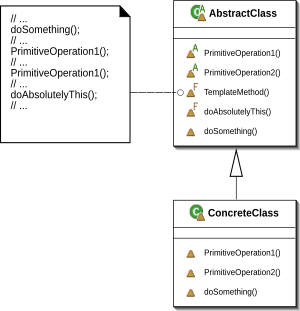

## 정의

- 템플릿 메서드 패턴은 알고리즘의 틀을 제공한다. 슈퍼 클래스에 알고리즘의 흐름을 구현한 템플릿 메서드를 구현하고, 하위 클래스에서 알고리즘을 확장해서 사용할 수 있도록 한다.

## 구조

- 추상 클래스에 알고리즘의 뼈대인 template method를 구현한다. 하위 클래스에서 수정할수 없도록, final 지시자를 사용한다.
- 공통된 메서드는 추상 클래스의 구상 메서드를 사용한다.
- 하위 클래스에서 추상메서드, hook을 오버라이드 해서 사용한다.
- hook은 추상클래스에서 기본적 동작만 구현한 메서드인데, 추가적으로 사용할 필요가 있으면 오버라이드 한다.

## 장단점

### 장점

- 코드 재사용에 큰 도움이 된다.
- 프레임 워크를 제공하기 때문에 하위 클래스를 추가하기 쉽다.
- 알고리즘에 대한 내용이 템플릿 메서드에 집중되어있어서 관리가 편하다.

### 단점

- 알고리즘이 템플릿 메서드에 종속되어 유연성을 잃어버릴 수 있다.
